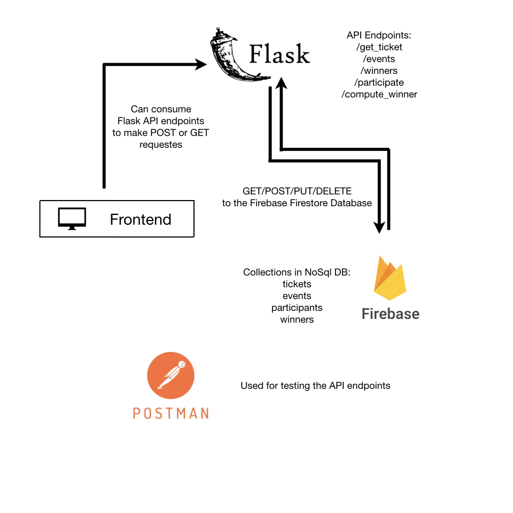
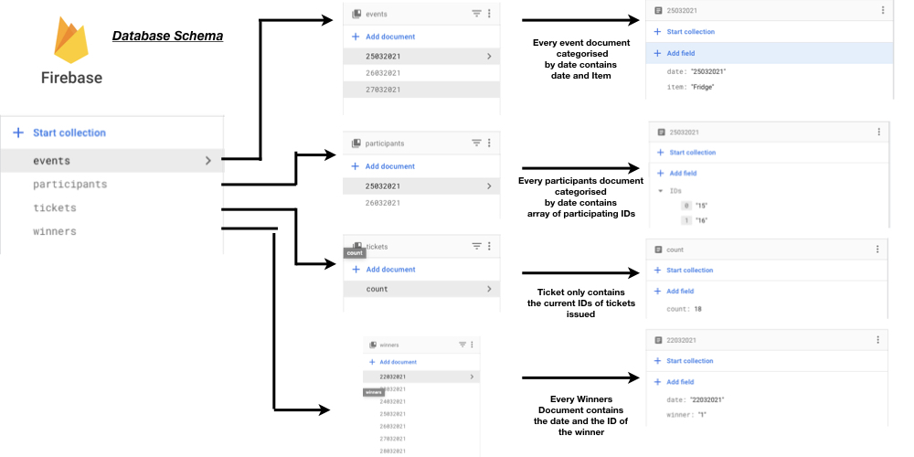

# lucky_draw
Lucky Draw API

A Flask API to implement a service which allows users to get Lucky Draw Raffle tickets and use one lucky draw raffle ticket to participate in a lucky draw game..


## Architecture

<p align="center">

</p>


## Database Schema

<p align="center">

</p>

## Directory Structure
    
    lucky_draw             
    .
    ├── Contains       
    |   ├── Screenshots       # Contain screenshots of the project and other images
    │   ├── app.py            # The main Flask app/api containing the API endpoints etc
    │   ├── DB.jpeg           # Google's Firestore Database Schema
    |   └── requirements.txt  # Requirements file
    |______________________   

## Instructions for Setup

Clone the repo and install Requirements :

```bash
git clone https://github.com/saket13/lucky_draw
cd path_to_lucky_draw
pip3 install -r requirements.txt (Install the requirements preferrably in Virtual environment)
```

Modify app.py File - Remove the existing JSON file for service account from Firestore and add yours:

```bash
cred = credentials.Certificate('file.json')
```

## Usage

Run the app.py file:

```python
python3 app.py
```

To get raffle tickets, visit the '/get_ticket' endpoint:

```bash
open http://127.0.0.1:8000/new 
to get raffle ticket ID
```

To participate in an event, visit the '/participate' endpoint:

```bash
open http://127.0.0.1:8000/participate
and POST with JSON format to participate in specified event
```

To get or post event, visit the '/events' endpoint:

```bash
open http://127.0.0.1:8000/events
to get upcoming events or POST with JSON format to add event
```

To find last 7 winners, visit the '/winners' endpoint:

```bash
open http://127.0.0.1:8000/winners
to get last 7 winners or POST with JSON format to add a new winner
```

To compute winner, visit the '/compute_winner' endpoint:

```bash
open http://127.0.0.1:8000/compute_winner
and POST with JSON format to compute a winner randomly
```


## Screenshots

Please find the screenshots of the API endpoints testing in the Screenshots folder


## Contact
If you need any help, you can connect with me.

Visit:- [saketsaumya.info](https://saketsaumya.info)
